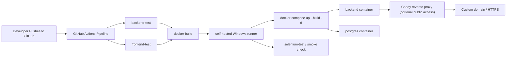

# Terra Sustainability Platform

[](https://github.com/bijaythms/TERRA-Enterprise-carbon-emission-management-system/actions/workflows/pipeline.yml)
[](https://github.com/bijaythms/TERRA-Enterprise-carbon-emission-management-system)
[](https://www.postgresql.org/)
[](https://github.com/bijaythms/TERRA-Enterprise-carbon-emission-management-system/actions)

This project now uses a split structure with [frontend](/D:/projectdevops/terra/frontend) for the UI and [backend](/D:/projectdevops/terra/backend) for the API/PostgreSQL logic. The app creates its tables automatically at startup, and the seed script populates demo data for local testing.

## Deployment Architecture



The production-style flow for this project is:

- GitHub stores the source code
- GitHub Actions runs the CI/CD pipeline
- a self-hosted Windows runner performs deployment
- Docker Compose starts the backend and PostgreSQL
- Caddy can be added in front for public HTTPS domain access

## Repository Structure

```text
.github/workflows/    GitHub Actions pipeline
backend/              Node.js + PostgreSQL backend
frontend/             Static frontend
docker-compose.yml    Core local and runner deployment stack
docker-compose.public.yml
                      Optional public reverse-proxy stack
Caddyfile             Domain and HTTPS reverse proxy config
README.md             Project and deployment documentation
```

## Run With Docker

1. Remove old containers and volumes if you previously ran the Mongo version:
```bash
docker-compose down -v
```

2. Start PostgreSQL and the backend:
```bash
docker-compose up --build
```

3. Open the app:
[http://localhost:5000](http://localhost:5000)

4. Optional: connect pgAdmin to the Docker database:
- Host: `localhost`
- Port: `5433`
- Database: `terra`
- Username: `postgres`
- Password: `postgres123`

## GitHub CI/CD

This project now includes a GitHub-ready automation setup:

- [pipeline.yml](/D:/projectdevops/terra/.github/workflows/pipeline.yml): one staged pipeline with `backend-test`, `frontend-test`, `docker-build`, `deploy`, and `selenium-test`
- [.gitignore](/D:/projectdevops/terra/.gitignore): ignores local dependencies, env files, logs, and generated files
- [.env.example](/D:/projectdevops/terra/.env.example): sample environment values for local or deployment setup

To use it with GitHub:

1. Initialize Git if needed:
```bash
git init
git add .
git commit -m "Initial Terra setup"
```

2. Create a GitHub repository and push your code:
```bash
git remote add origin <your-github-repo-url>
git branch -M main
git push -u origin main
```

3. GitHub Actions will then automatically run the workflow files inside:
```text
.github/workflows
```

4. The pipeline publishes a Docker image to:
```text
ghcr.io/<your-username-or-org>/<repo-name>/terra-backend
```

5. To make the deploy and final smoke-check stages work through GitHub Actions runner:
- install a self-hosted GitHub Actions runner on the machine where you want deployment
- make sure Docker Desktop or Docker Engine is installed on that runner machine
- keep the runner labels matching the workflow:
```text
self-hosted, windows
```

6. The deploy stage runs directly on the self-hosted runner and executes:
```text
docker compose down
docker compose up --build -d
```

7. The final smoke-check stage validates:
```text
http://localhost:5000/health
http://localhost:5000/
```

## Branch Protection Suggestions

For a cleaner production workflow on GitHub, enable branch protection on `main` with these rules:

- require a pull request before merging
- require status checks to pass before merging
  use the workflow jobs:
  `backend-test`, `frontend-test`, `docker-build`
- block force pushes
- block branch deletion
- require branches to be up to date before merging

Recommended GitHub path:

1. Open your repo on GitHub.
2. Go to `Settings`.
3. Open `Branches`.
4. Add a branch protection rule for `main`.

## Public Domain / HTTPS Setup

If you want the app to be publicly available from your runner machine with a real domain, use the included Caddy setup:

- [Caddyfile](/D:/projectdevops/terra/Caddyfile)
- [docker-compose.public.yml](/D:/projectdevops/terra/docker-compose.public.yml)

### 1. Point your domain

Create a DNS record for your server or runner machine:

- `A` record -> your public IP
or
- `CNAME` -> your public hostname

### 2. Update the domain in Caddy

Edit [Caddyfile](/D:/projectdevops/terra/Caddyfile) and replace:

```text
your-domain.com
```

with your real domain, for example:

```text
terra.yourdomain.com
```

### 3. Start the public stack

Run:

```bash
docker compose up --build -d
docker compose -f docker-compose.yml -f docker-compose.public.yml up -d
```

This gives you:

- backend on internal Docker networking
- PostgreSQL on Docker volume storage
- Caddy on ports `80` and `443`
- automatic HTTPS certificates from Caddy

### 4. Open firewall/router ports

Make sure these are reachable from the internet:

- `80`
- `443`

If your deployment machine is behind a router, forward ports `80` and `443` to that machine.

## GitHub Badges

The README now includes badges for:

- GitHub Actions pipeline
- Docker Compose stack
- PostgreSQL
- self-hosted runner deployment

After your next push to GitHub, the workflow badge will reflect live pipeline status.

## Run Without Docker

1. Make sure PostgreSQL is running locally.
2. Create a database named `terra`.
3. From [backend/package.json](/D:/projectdevops/terra/backend/package.json), install dependencies:
```bash
cd backend
npm install
```
4. Set these environment variables if you are not using the defaults:
```bash
POSTGRES_HOST=localhost
POSTGRES_PORT=5432
POSTGRES_DB=terra
POSTGRES_USER=postgres
POSTGRES_PASSWORD=postgres123
OPENAI_API_KEY=your_openai_api_key
OPENAI_MODEL=gpt-5-mini
```
5. Start the backend:
```bash
npm start
```

## AI Advisor

The AI Advisor now supports real LLM-generated recommendations through the OpenAI Responses API. If `OPENAI_API_KEY` is present, the backend will request more natural recommendations from the configured OpenAI model. If the key is missing or the API request fails, the app automatically falls back to the existing rule-based advisor so the feature still works locally.

If you run with Docker in PowerShell, set the variables in your shell before starting Compose:
```bash
$env:OPENAI_API_KEY="your_openai_api_key"
$env:OPENAI_MODEL="gpt-5-mini"
docker compose up --build
```

## Seed Demo Data

Run:
```bash
cd backend
npm run seed
```

## Demo Login Credentials

| Role    | Email                | Password   |
|---------|----------------------|------------|
| Admin   | admin@terra.io       | admin123   |
| Company | anika@acmecorp.com   | company123 |
| Company | m.klein@greentech.io | company123 |
| Company | vertex@vertex.com    | company123 |
